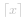

#### 前言

由于本题是「力扣杯」的竞赛题，因此只会给出提示、简要思路以及代码，不会对算法本身进行详细说明，希望读者多多思考。

#### 提示 *1*

显然应该把所有「升级水桶」的操作放在「蓄水」操作之前。

#### 提示 *2*

枚举「蓄水」的次数，倒推出每个水桶的容量，并计算出「升级水桶」的操作次数。

#### 思路

我们枚举「蓄水」的次数 *k*，那么对于容量为 *v* 的水缸，就至少需要一个容量为

 

的水桶，其中   表示对 *x* 向上取整。这样我们就能计算出每个水桶需要「升级」多少次了。

#### 代码

```C++ [sol1-C++]
class Solution {
public:
    int storeWater(vector<int>& bucket, vector<int>& vat) {
        int n = bucket.size();
        int maxk = *max_element(vat.begin(), vat.end());
        if (!maxk) {
            return 0;
        }

        int ans = INT_MAX;
        for (int k = 1; k <= maxk; ++k) {
            int cur = k;
            for (int i = 0; i < n; ++i) {
                int least = vat[i] / k + (vat[i] % k != 0);
                cur += max(least - bucket[i], 0);
            }
            ans = min(ans, cur);
        }
        return ans;
    }
};
```

