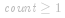

#### 方法一：  投票算法

由于题目要求时间复杂度 *O(n)* 和空间复杂度 *O(1)*，因此符合要求的解法只有   投票算法。

  投票算法的基本思想是：在每一轮投票过程中，从数组中删除两个不同的元素，直到投票过程无法继续，此时数组为空或者数组中剩下的元素都相等。

- 如果数组为空，则数组中不存在主要元素；

- 如果数组中剩下的元素都相等，则数组中剩下的元素可能为主要元素。

  投票算法的步骤如下：

1. 维护一个候选主要元素   和候选主要元素的出现次数  ，初始时   为任意值， ；

2. 遍历数组   中的所有元素，遍历到元素 *x* 时，进行如下操作：

   1. 如果  ，则将 *x* 的值赋给  ，否则不更新   的值；

   2. 如果  ，则将   加 *1*，否则将   减 *1*。

3. 遍历结束之后，如果数组   中存在主要元素，则   即为主要元素，否则   可能为数组中的任意一个元素。

由于不一定存在主要元素，因此需要第二次遍历数组，验证   是否为主要元素。第二次遍历时，统计   在数组中的出现次数，如果出现次数大于数组长度的一半，则   是主要元素，返回  ，否则数组中不存在主要元素，返回 *-1*。

为什么当数组中存在主要元素时，  投票算法可以确保得到主要元素？

在   投票算法中，遇到相同的数则将   加 *1*，遇到不同的数则将   减 *1*。根据主要元素的定义，主要元素的出现次数大于其他元素的出现次数之和，因此在遍历过程中，主要元素和其他元素两两抵消，最后一定剩下至少一个主要元素，此时   为主要元素，且  。

                         

```Java [sol1-Java]
class Solution {
    public int majorityElement(int[] nums) {
        int candidate = -1;
        int count = 0;
        for (int num : nums) {
            if (count == 0) {
                candidate = num;
            }
            if (num == candidate) {
                count++;
            } else {
                count--;
            }
        }
        count = 0;
        int length = nums.length;
        for (int num : nums) {
            if (num == candidate) {
                count++;
            }
        }
        return count * 2 > length ? candidate : -1;
    }
}
```

```C# [sol1-C#]
public class Solution {
    public int MajorityElement(int[] nums) {
        int candidate = -1;
        int count = 0;
        foreach (int num in nums) {
            if (count == 0) {
                candidate = num;
            }
            if (num == candidate) {
                count++;
            } else {
                count--;
            }
        }
        count = 0;
        int length = nums.Length;
        foreach (int num in nums) {
            if (num == candidate) {
                count++;
            }
        }
        return count * 2 > length ? candidate : -1;
    }
}
```

```JavaScript [sol1-JavaScript]
var majorityElement = function(nums) {
    let candidate = -1;
    let count = 0;
    for (const num of nums) {
        if (count === 0) {
            candidate = num;
        }
        if (num === candidate) {
            count++;
        } else {
            count--;
        }
    }
    count = 0;
    const length = nums.length;
    for (const num of nums) {
        if (num === candidate) {
            count++;
        }
    }
    return count * 2 > length ? candidate : -1;
};
```

```C++ [sol1-C++]
class Solution {
public:
    int majorityElement(vector<int>& nums) {
        int candidate = -1;
        int count = 0;
        for (int& num : nums) {
            if (count == 0) {
                candidate = num;
            }
            if (num == candidate) {
                count++;
            } else {
                count--;
            }
        }
        count = 0;
        int length = nums.size();
        for (int& num : nums) {
            if (num == candidate) {
                count++;
            }
        }
        return count * 2 > length ? candidate : -1;
    }
};
```

```C [sol1-C]
int majorityElement(int* nums, int numsSize) {
    int candidate = -1;
    int count = 0;
    for (int i = 0; i < numsSize; i++) {
        if (count == 0) {
            candidate = nums[i];
        }
        if (nums[i] == candidate) {
            count++;
        } else {
            count--;
        }
    }
    count = 0;
    int length = numsSize;
    for (int i = 0; i < numsSize; i++) {
        if (nums[i] == candidate) {
            count++;
        }
    }
    return count * 2 > length ? candidate : -1;
}
```

```go [sol1-Golang]
func majorityElement(nums []int) int {
    candidate := -1
    count := 0
    for _, num := range nums {
        if count == 0 {
            candidate = num
        }
        if num == candidate {
            count++
        } else {
            count--
        }
    }
    count = 0
    for _, num := range nums {
        if num == candidate {
            count++
        }
    }
    if count*2 > len(nums) {
        return candidate
    }
    return -1
}
```

**复杂度分析**

- 时间复杂度：*O(n)*，其中 *n* 是数组   的长度。需要遍历数组两次。

- 空间复杂度：*O(1)*。只需要常数的额外空间。